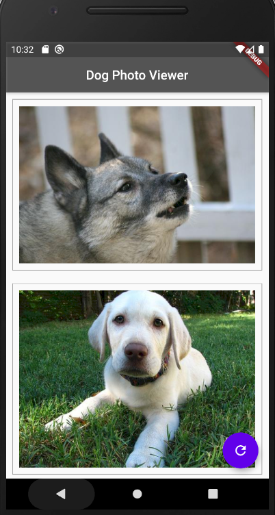

# Flutter Demo Projects for Learning Purpose

all of my flutter learning projects

| Day   | Project Name     | ScreenShot                                  | Code                                   | Remarks                                         |
| ----- | ---------------- | ------------------------------------------- | -------------------------------------- | ----------------------------------------------- |
| Day 1 | Poor Brothers    |       | [poor_brothers](./poor_brothers)       | Simple app to show asset image                  |
| Day 2 | ShoppingList     |        | [basic_cart](./basic_cart)             | Simple shopping list cart                       |
| Day 3 | Flutter Layout   |  | [flutter_layout](./flutter_layout)     | Basic Flutter Layout                            |
| Day 4 | Login UI         |   | [login_ui](./basic_login_ui)           | Simple login UI app                             |
| Day 5 | Dog Photo Viewer |   | [dog_photo_viewer](./dog_photo_viewer) | Working with API to show some random dog photos |
